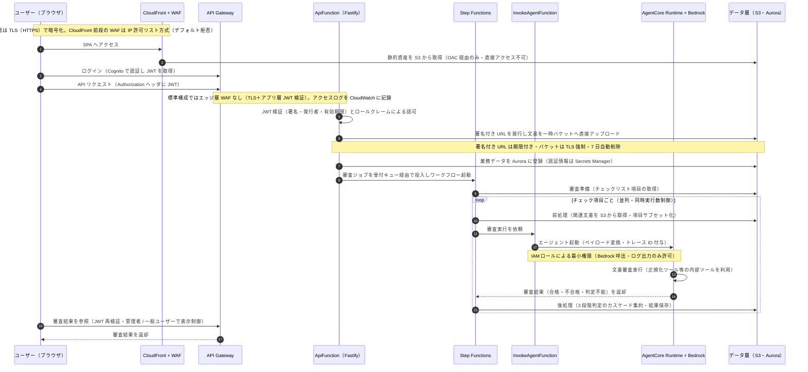

# システムアーキテクチャ概要（リソース一覧・セキュリティ実装方式）

## 1. システム概要

本システムは、アップロードされた文書からチェックリストを生成し、AI エージェント（Amazon Bedrock）による文書審査を自動実行して結果を表示する、文書審査支援システムです。

主な処理の流れは以下のとおりです。

1. ユーザーが審査対象文書をアップロードする
2. チェックリスト生成ワークフロー（Step Functions）が文書を解析し、チェックリスト項目を生成する
3. ユーザーが審査ジョブを作成すると、審査実行ワークフロー（Step Functions）がチェックリスト項目ごとに AI エージェントによる審査を並列実行する
4. 審査結果（合格・不合格・判定不能の 3 段階）がデータベースに集約され、画面で参照できる

本文書は標準構成（パブリックエッジ構成）を主として説明し、最後にクローズドネットワーク構成（完全閉域）の違いを注記します。

---

## 2. リソース一覧

### 2.1 Lambda 関数（8 件）とエージェント実行環境（1 件）

| # | 名前 | 種別 | 機能 |
|---|------|------|------|
| 1 | ApiFunction | Lambda（Docker / Node.js） | REST API 本体（Fastify）。全業務 API の受付、JWT 検証、署名付き URL 発行、ワークフロー起動を行う |
| 2 | ChecklistWorkflowLambda | Lambda（Docker / Node.js） | チェックリスト生成ワークフローのタスク処理。文書解析と Bedrock モデル連携によりチェックリスト項目を生成する |
| 3 | ReviewWorkflowLambda | Lambda（Docker / Node.js） | 審査実行ワークフローのタスク処理。審査準備（項目取得）、AI 審査前の前処理（文書取得・項目サブセット化）、審査後の後処理（3 段階判定の集約・結果保存）を担う |
| 4 | InvokeAgentFunction | Lambda（Node.js） | Step Functions とエージェント実行環境の橋渡し。ペイロード変換とトレース ID 管理を行い、エージェントを起動する |
| 5 | ReviewQueueConsumerFunction | Lambda（Python） | 審査受付キュー（SQS FIFO）を消費し、審査ワークフローを起動する。同時実行数の制御も行う |
| 6 | AmbiguityWorkerLambda | Lambda（Docker / Node.js） | チェックリスト項目の曖昧性を検出する（Bedrock による判定）。キュー経由で非同期処理される |
| 7 | FeedbackAggregatorFunction | Lambda（Docker / Node.js） | フィードバックの定期集約バッチ。EventBridge Scheduler により毎日定時に起動し、Bedrock で要約を生成する |
| 8 | MigrationFunction | Lambda（Docker / Node.js） | デプロイ時にのみ起動し、データベーススキーマのマイグレーション（Prisma）を実行する |
| 9 | AgentCore Runtime | Bedrock AgentCore（コンテナ） | 審査エージェント本体の実行環境（Python / Strands）。Bedrock モデルの呼び出しと、正規化ツール等の内部ツール実行を担う（Lambda ではなく AWS マネージドのランタイム） |

### 2.2 ワークフロー・キュー

| 名前 | 種別 | 機能 |
|------|------|------|
| DocumentProcessingStateMachine | Step Functions | チェックリスト生成フロー。文書ページ単位に Map 状態で並列解析する |
| ReviewProcessingWorkflow | Step Functions | 審査実行フロー。準備 → チェック項目ごとの並列処理（前処理 → AI 審査 → 後処理）→ 完了の状態マシン |
| 審査受付キュー（FIFO）+ DLQ | SQS | 審査ジョブの受付と順序制御。処理失敗時はデッドレターキューへ退避 |
| 曖昧性検出キュー + DLQ | SQS | 曖昧性検出タスクの非同期受付 |

### 2.3 データストア

| 名前 | 種別 | 機能 |
|------|------|------|
| DocumentBucket | S3 | 審査対象文書の保管。サーバ側暗号化・パブリックアクセス遮蔽・TLS 通信強制 |
| TempBucket | S3 | アップロード一時領域。7 日で自動削除（ライフサイクルルール） |
| AccessLogBucket | S3 | 各バケットのサーバアクセスログの保管 |
| フロントエンド資産バケット | S3 | SPA の静的資産保管。CloudFront からの OAC 経由のみアクセス可能 |
| データベース | Aurora MySQL（Serverless v2） | 業務データ（チェックリスト・審査ジョブ・審査結果等）の保管。ストレージ暗号化、VPC 内のみ配置 |
| Secrets Manager | AWS サービス | データベース認証情報の一元管理 |

### 2.4 エッジ・API・認証

| 名前 | 種別 | 機能 |
|------|------|------|
| CloudFront Distribution | CDN | フロントエンド（SPA）の配信。オリジンは S3（OAC による直接アクセス制限） |
| フロントエンド用 WAF | WAF | CloudFront 前段の保護。IP 許可リスト方式（デフォルト拒否） |
| バックエンド API 用 WAF | WAF | API Gateway stage の保護（IP 許可リスト・デフォルト拒否）。**S3+API Gateway 構成・クローズドネットワーク構成のみ**。標準構成ではバックエンド API に WAF は付与されず、TLS とアプリ層の JWT 検証により保護 |
| RapidApi（バックエンド） | API Gateway（REST） | 業務 API のエントリポイント。アクセスログを CloudWatch に出力 |
| Cognito User Pool | AWS サービス | ユーザー認証（ユーザー名 / パスワード、ホスト UI）。JWT 発行とロールクレーム管理 |

### 2.5 ネットワーク・運用

| 名前 | 種別 | 機能 |
|------|------|------|
| VPC | EC2 VPC | Lambda・データベース等の隔離されたネットワーク。サブネット分割とセキュリティグループで通信を制御 |
| VPC Flow Logs | CloudWatch | ネットワーク通信の監査ログ |
| EventBridge Scheduler | AWS サービス | フィードバック集約バッチの定時起動 |
| X-Ray | AWS サービス | 分散トレーシング（審査処理の追跡） |

---

## 3. メインフローとセキュリティ（泳道図）

審査実行を主軸とした、リクエストから結果保存までの流れと、各区間で働くセキュリティ機構を以下に示します。

---

## 4. セキュリティ実装方式

### 4.1 エッジ保護（WAF / CDN）

- **フロントエンド（CloudFront）**：前段に AWS WAF を配置。**IP 許可リスト方式（デフォルト拒否）**により、許可された IP からのアクセスのみ受け付ける。静的資産は OAC（Origin Access Control）経由のみ配信され、バケットへの直接アクセスは不可
- **バックエンド API（API Gateway）**：標準構成ではフロントエンドから execute-api エンドポイントへ直接接続するため、CloudFront WAF の適用範囲外。エッジ層の WAF は付与せず、TLS による通信暗号化とアプリ層での JWT 検証（4.2）により保護する設計
- **S3+API Gateway 構成・クローズドネットワーク構成**では、フロントエンド・バックエンド両方の API stage に Regional WAF（IP 許可リスト・デフォルト拒否）を付与（多層防御）

### 4.2 認証（Authentication）

- AWS Cognito User Pool によるユーザー認証（ユーザー名 / パスワード、ホスト UI）
- クライアントは JWT を取得し、以降の API リクエストの Authorization ヘッダに付与
- バックエンド（ApiFunction）はリクエストごとに JWT を検証：署名（JWKS 公開鍵）、発行者、有効期限を確認
- なおローカル開発環境限定で認証をバイパスする仕組みが存在するが、デプロイ環境では無効

### 4.3 認可（Authorization）

- JWT 内のロールクレームに基づく権限判定（例：管理者ロール）
- 管理者限定機能（例：ツール設定・プロンプト設定・サンプル管理等の管理画面）は、フロントエンドのルート保護とバックエンドの権限チェックの二層で制限

### 4.4 ネットワーク保護

- Lambda・Aurora 等は VPC 内に配置し、サブネット分割とセキュリティグループで通信経路を制限
- データベースへの接続は、明示的に許可されたセキュリティグループからの通信のみ受付
- VPC Flow Logs によりネットワークレベルの監査証跡を確保

### 4.5 データ保護

- **S3**：全バケットでサーバ側暗号化（SSE）、パブリックアクセス完全遮蔽、TLS 通信強制（enforceSSL）
- **一時アップロード領域**：署名付き URL（期限付き）による直接アップロード、7 日後の自動削除
- **Aurora**：ストレージ暗号化、VPC 内のみ配置、認証情報は Secrets Manager で一元管理
- **SQS**：SQS マネージド型の暗号化、処理失敗時はデッドレターキューへ退避

### 4.6 IAM（最小権限）

- 各 Lambda・エージェント実行環境には個別の IAM ロールを付与し、必要なアクションのみ許可（例：審査エージェントのロールは Bedrock 呼出とログ出力のみ、データベース接続は許可セキュリティグループを持つ関数のみ）
- Step Functions から Lambda への呼び出しも IAM により明示的に許可された経路のみ

### 4.7 監査・可観測性

- API Gateway のアクセスログ（CloudWatch）
- S3 サーバアクセスログの一元保管
- VPC Flow Logs
- X-Ray による分散トレーシング（審査処理の追跡）
- インフラ定義は cdk-nag（セキュリティ Lint）によりベストプラクティス違反を継続検査

---

## 5. クローズドネットワーク構成（注記）

本システムには、データを閉域網内に閉じ込める **完全プライベート構成（クローズドネットワークモード）** があります。標準構成との主な違いは以下のとおりです。

| 項目 | 標準構成 | クローズドネットワーク構成 |
|------|---------|--------------------------|
| サブネット | パブリック / プライベート + NAT | 分離（隔離）サブネットのみ、NAT なし（インターネット出口なし） |
| API Gateway | 通常のエンドポイント | PRIVATE エンドポイント（VPC 内からのみアクセス可能） |
| WAF | CloudFront にのみ付与（API stage にはなし） | フロントエンド・バックエンド両 API stage に Regional WAF を付与（IP 許可リスト・デフォルト拒否） |
| AWS サービス接続 | インターネット経由 | PrivateLink（VPC エンドポイント）経由：S3・Bedrock・AgentCore・Cognito・Secrets Manager 等 |
| エージェント実行環境 | AWS マネージドネットワーク | VPC 内で実行（外部への通信経路なし） |
| モデル推論 | リージョン固定のモデル ID でデータ所在地を保証 | 同左（クロスリージョン推論は無効化） |

この構成では、審査対象文書や審査結果がインターネットを経由せず、閉域内の AWS リソース間でのみ処理されます。フロントエンド配信についても CloudFront の代わりにプライベートな配信経路（API Gateway 経由の S3 配信）を利用可能です。
