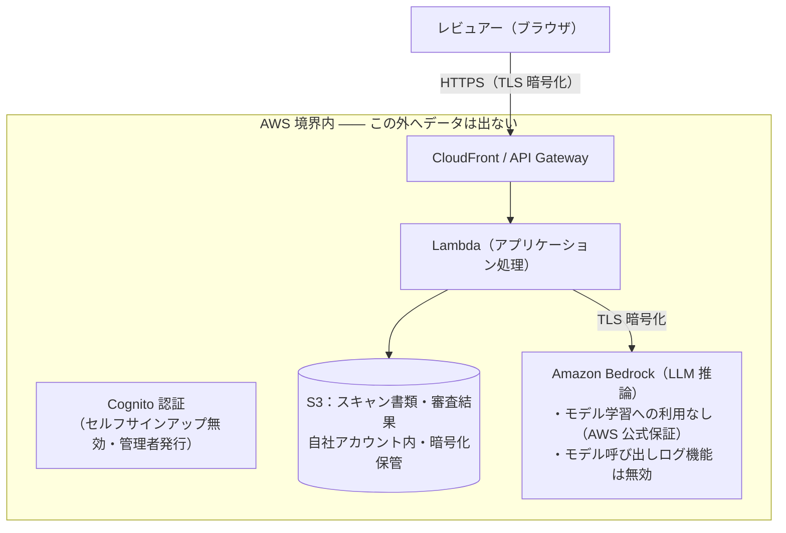

# データ取り扱いの現状と「会社外持ち出し禁止」要求への対応選択肢（社内参考資料）

- 作成日：2026-09-16
- 目的：提案時に想定される「機密情報・個人情報の取り扱い」に関する質問へ備え、現状のデータ利用範囲と、万一の硬性要求（データを会社外へ出さない）が出た場合の選択肢を整理する
- 区分：**社内参考資料（提案者向け）** — 顧客への直接提示を想定していない
- 根拠資料：`docs/research/aws-bedrock-guardrails-mechanism.md`（AWS 公式ドキュメント等、一次資料 50 件以上に基づく調査報告）

---

## 1. 現状：データの利用範囲はすべて AWS 境界内で完結

本システム（登記書類整合性レビュー）における機密情報を含むデータの流れは、**すべて自社 AWS アカウント内のリソースと、AWS が管理するサービス（Amazon Bedrock）の間で完結**しており、AWS 境界の外へデータが送信される経路は存在しません。

現状のセキュリティ特性：

| 項目 | 現状 |
| --- | --- |
| スキャン書類の保管 | 自社 AWS アカウント内の S3（暗号化保管）。他テナント・インターネットからは直接アクセス不可 |
| LLM への送信 | 同じ AWS アカウントから Amazon Bedrock へ TLS 暗号化でリクエスト。インターネット上の第三者 AI サービスは不使用 |
| モデル学習への利用 | AWS は Bedrock の入出力（プロンプト・応答）を**モデルの学習に使用しない**ことを公式に保証（Bedrock FAQ） |
| モデル呼び出しログ | プロンプト・応答を CloudWatch / S3 に記録する「モデル呼び出しログ」機能は**無効** |
| 利用者認証 | Cognito による認証必須。セルフサインアップは無効、アカウントは管理者が発行 |
| 閉域網対応 | インターネット経路を排除する閉域網モード（VPC エンドポイント構成）を実装済み。必要に応じて有効化可能 |

### AWS による LLM データ利用の公式保証

「AWS やモデル提供者が我々のデータを学習等に使うのではないか」という想定質問への根拠となる、AWS 公式の保証（2026-09-16 時点の現行ページ）。重要な点として、これらの保証は**自社モデル（Nova / Titan）と第三者モデル（Claude 等）で同一の文言**であり、Claude を使っていること自体は保証を弱めない。

| 保証項目 | 内容（AWS 公式からの引用・要約） |
| --- | --- |
| 学習への不使用 | "your content is **not used to improve the base models** and is not shared with any model providers."／"AWS and the third-party model providers **will not use any inputs to or outputs from** Amazon Bedrock **to train** Amazon Nova, Amazon Titan, **or any third-party models**."（[Bedrock FAQ](https://aws.amazon.com/bedrock/faqs/)） |
| モデル提供者への非共有 | "Users' inputs and model outputs are **not shared with any model providers**."（同上）。プロンプト・応答が Anthropic 等の提供者に渡ることはない。現行の公式 FAQ に第三者提供者への「opt-in 共有」の仕組みは存在せず、**無条件の不共有** |
| 運用者アクセス・保存の原則 | Bedrock は **ZOA（zero operator access）**＝サービス運用者はモデル入出力にアクセス不能、かつ **ZDR（zero data retention）**＝既定ではモデル入出力を保存しない、というデータセキュリティモデルを採用（[abuse detection ドキュメント](https://docs.aws.amazon.com/bedrock/latest/userguide/abuse-detection.html)） |
| 保存の例外（不正利用検知） | 不正利用検知のため、**特定の新型モデルのみ**入出力を最長 30 日保存する例外がある（OpenAI・Anthropic の一部機種。保存は AWS 内のみで、第三者提供者とは共有されない）。**本システムが使用する Claude Sonnet 4.6 はこの例外リストに含まれず、既定の ZDR（非保存）が適用される**。※リストは新モデル追加に伴い変動するため、定期的な確認を推奨 |
| モデル呼び出しログ | プロンプト・応答のログ取得機能は顧客が任意で有効化し、保存先も**顧客自身の暗号化 S3 バケット**となる（AWS 既定では何も記録されない）。本システムでは無効（前表参照） |
| コンプライアンス認証 | Amazon Bedrock は SOC・ISO・HIPAA 対応・GDPR・CSA STAR Level 2 の適用範囲内（Bedrock サービス単位の認証であり、其上で動くモデルの種類を問わない）。AWS は日本政府調達の ISMAP 認定を取得済み（サービス単位の適用範囲は ISMAP ポータルのクラウドサービスリストで確認が必要） |

つまり現状は「**データを AWS という信頼境界の中に留める**」構成であり、クラウド利用として標準的かつ合理的なセキュリティ水準です。すべてのデータ保管・処理が自社管理の AWS アカウントと AWS の管理するインフラ内で行われている事実は、提案時の説明の基盤になります。

## 2. なぜ Amazon Bedrock Guardrails では「情報漏洩防止」を満たせないのか

Guardrails 追加の検討が上がる可能性がありますが、**本システムの目的（機密情報の外部漏洩防止）に対して効果がない**ことが、AWS 公式ドキュメントに基づく調査で確認できています。

まず機構の整理：Guardrails は入出力**テキスト**を検査・マスクする機能ですが、検査自体は AWS 内の検出サービスで行われます。したがって「データを AWS の外へ出さない」という課題には寄与せず、後述の通り本システムでは以下の 3 点がすべて成立しません。

| # | 理由 | 説明 |
| --- | --- | --- |
| 1 | **そもそも主経路が対象外** | 本システムはスキャン PDF を `document` ブロックとしてモデルへ直接送信するが、Guardrails の機密情報フィルタは「**テキストのみ**評価」（公式明記）であり、PDF 文書ブロックは検査対象に含まれない。登記書類の機密情報は主にこの PDF 内に存在する |
| 2 | **業務とマスクが矛盾する** | 審査業務の中核は氏名・住所・借入情報などの**照合そのもの**。Guardrails が PII を `{NAME}` 等のプレースホルダに置き換えると、モデルは照合対象を認識できず審査が成立しない。審査結果（NG 理由）も具体的な不一致値の引用を要するため、出力側マスクも同様に使えない |
| 3 | **日本語実体の欠如** | Guardrails の内蔵 PII 実体リスト（General / Finance / IT / US / CA / UK）に日本固有の実体（日本語氏名・住所形式等）はなく、正規表現の自家定義・保守が必要になる |

## 3. 万一「データを会社外（AWS 含む）へ出さない」が硬性要求になった場合の選択肢

前提として、**AWS にはオンプレミス形態の Bedrock は存在しません**（Outposts 等でも不提供）。AWS を含むクラウドの外で LLM を利用する場合は、次の 2 系統が現実的な選択肢になります。なお Azure OpenAI や Google Vertex AI の「プライベート」構成もベンダーのクラウド内であり、会社内網にはなりません。

| 選択肢 | 概要 | 参考 |
| --- | --- | --- |
| A. オープンウェイトモデルの自社運用 | vLLM 等の推論基盤で Llama / Qwen / Mistral 系などの開放重みモデルを自社 GPU サーバー上で運用 | 「社内 LLM」の主流実装。技術的には成熟 |
| B. 国内ベンダーのオンプレミス商用提供 | ライセンス契約により自社環境へ導入する国産モデル | **NTT tsuzumi / NEC cotomi / 富士通 Takane / PFN PLaMo**（2026-09 時点、各社公式にオンプレ提供を確認済み） |

共通する懸念（提案時に率直に説明すべき点）：

1. **審査精度の再現が最大のリスク**：本システムの核心は日本語登記書類（PDF・画像）のマルチモーダル読取と照合であり、Claude / Nova との精度差は PoC で確認するまで判断できない
2. **コストと運用**：GPU 調達・電力・障害対応が自社責任になる
3. **モデル更新**：改善・更新のペースを自社で管理する必要がある

## 4. 結論：提案時の基本スタンス

1. **現状の AWS 内完結構成は合理的なセキュリティ水準**であり、「データを AWS 内に留める」ことをご了解いただける限り、現状のままでご提案可能
2. **Guardrails の追加は「情報漏洩防止」の目的に対して効果がなく**（第 2 節の 3 理由）、導入提案は不要
3. 「データを会社外へ一切出さない」が**硬性要求**である場合に限り、オンプレミス選択肢（第 3 節）の評価を別途ご提案する。その場合は必ず審査精度の PoC を先行させる

---

*本資料の技術的根拠（Guardrails の機構、AWS のデータ利用保証、各種オンプレミス提供の公式確認）はすべて `docs/research/aws-bedrock-guardrails-mechanism.md` に一次ソース付きで記載している。提案前の詳細確認はそちらを参照のこと。*
